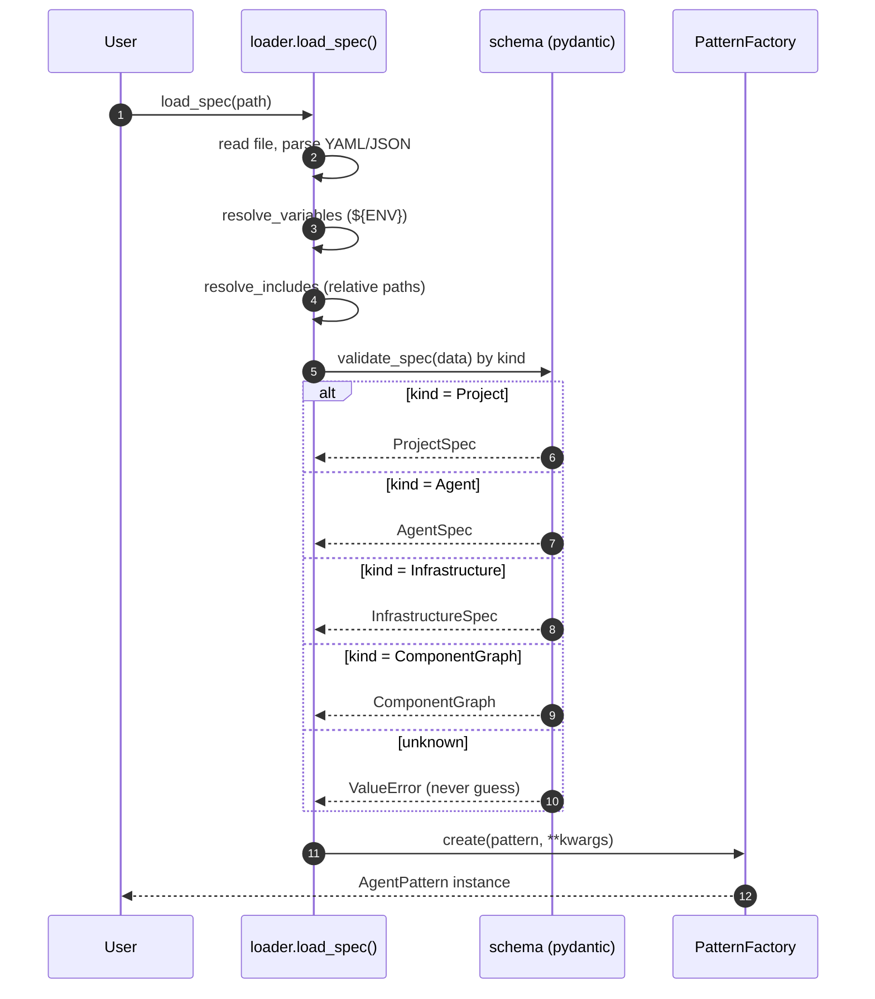
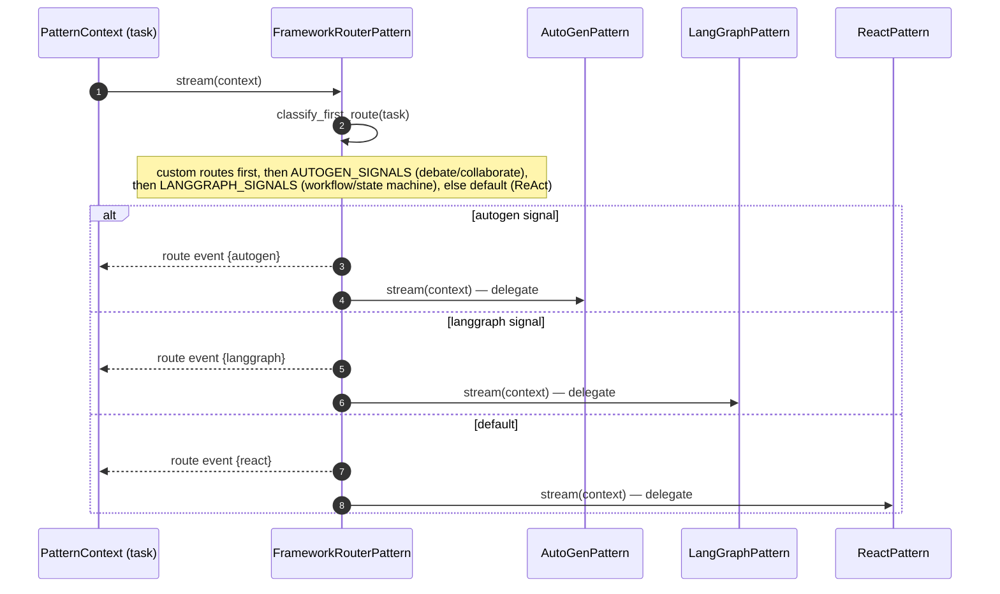
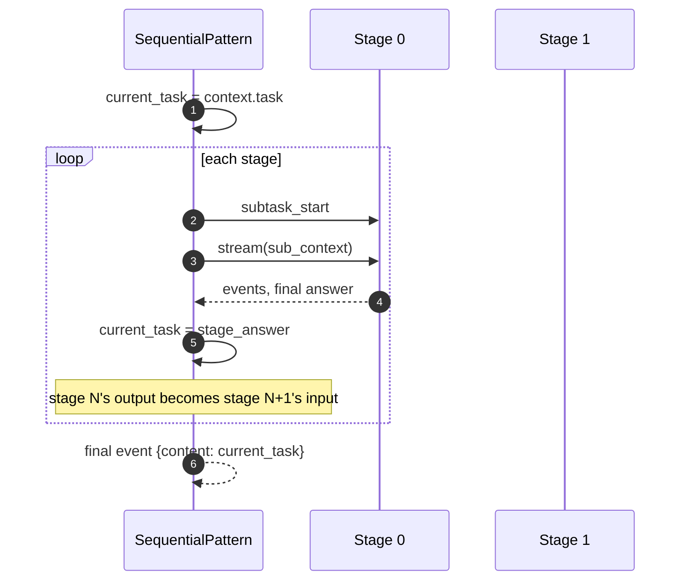
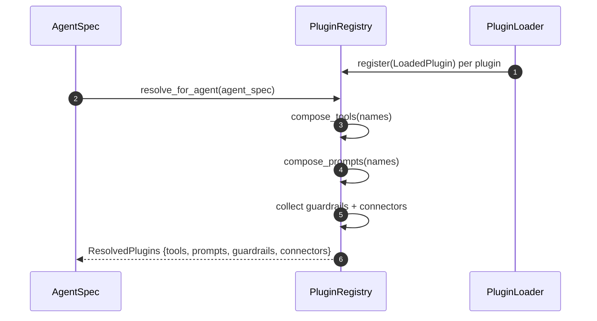
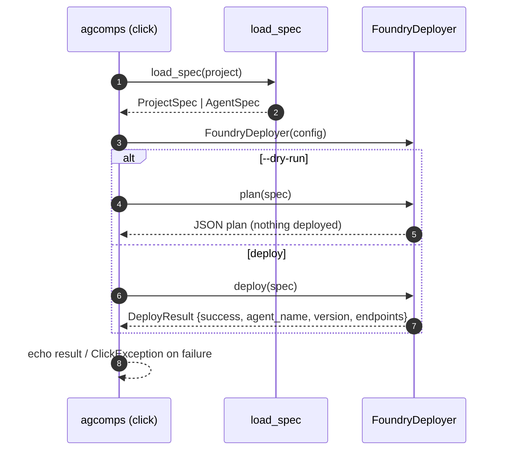
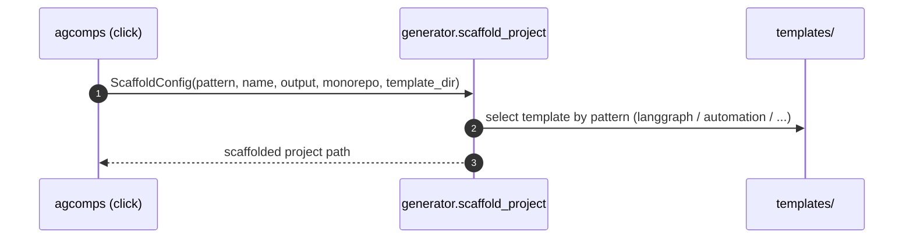

# Code Flow — agent-components

> The three flows that define the chassis: **spec → pattern → runtime**, **the
> framework-router decision**, and **spec → deploy**.

## 1. Spec loading → pattern instantiation

## 2. Framework router — first-route classification

## 3. Sequential pattern — context threading

## 4. Plugin resolution

## 5. Deploy flow (`agcomps deploy`)

## 6. Scaffold flow (`agcomps new`)

