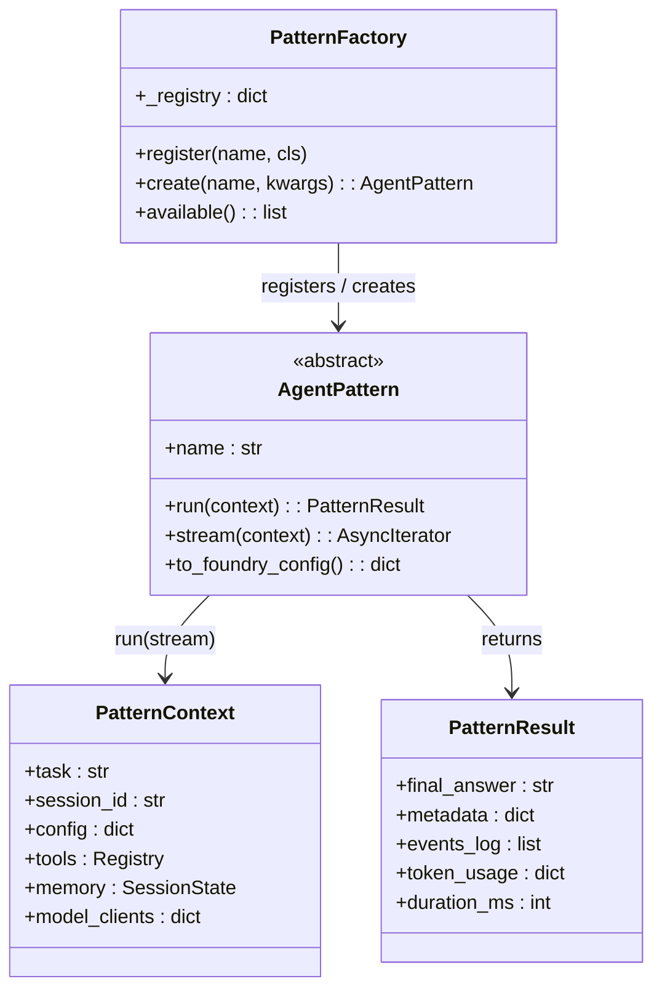
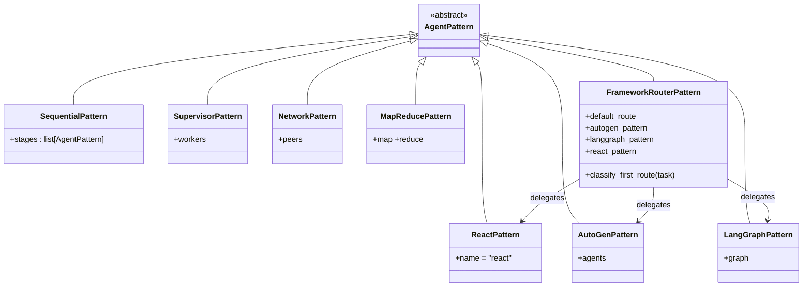
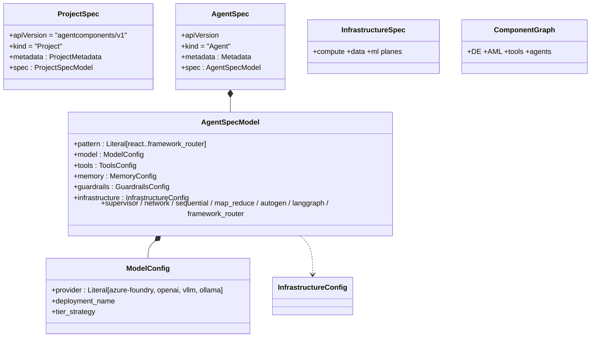
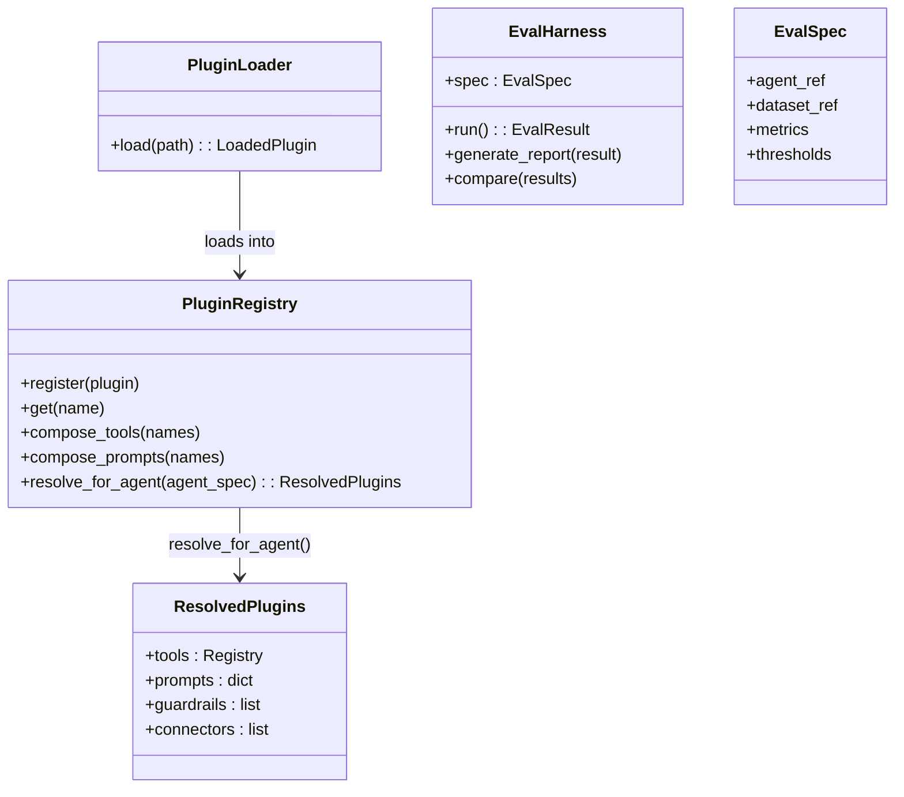
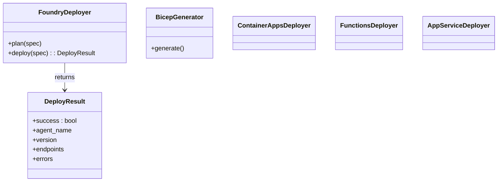
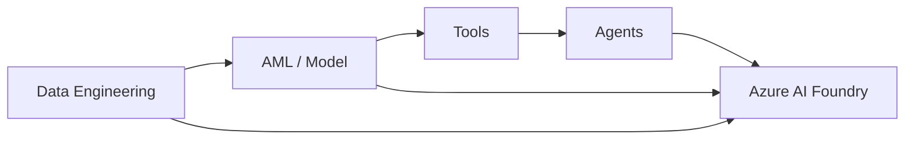

# UML Mapping — agent-components

> Class-level map of the agentic chassis. The spine: `AgentPattern` is the abstract
> base every pattern implements, `PatternFactory` registers them, and the schema
> layer validates the declarative YAML that wires a pattern to a model, tools,
> memory, and infra.

## 1. The pattern base + factory

## 2. The eight pattern implementations

## 3. The schema layer

## 4. Plugins + engineering

## 5. The deployer

## 6. Component graph — the end-to-end wiring

